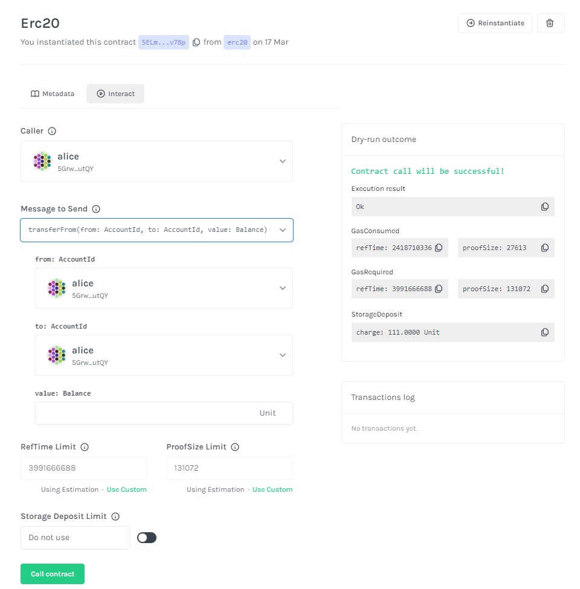

# develop-smart-contracts

Use the [ink!](https://use.ink/) programming language to build smart contracts that run on a Substrate-based blockchain

## Interact with smart contract 

1. Update your Rust environment and install contract. [Here!](https://docs.substrate.io/tutorials/smart-contracts/prepare-your-first-contract/)

2. Go to one of smart contracts packages and build it:

```bash
cd erc20
cargo contract build --release 
```

3. We need start a node. I used my [pallet-collectibles](https://github.com/Heezay/pallet-collectibles) crate. To start the node use:

```bash
cargo build --release 
# and then
./target/release/node-template --dev
```

3. Open [Contracts UI](https://contracts-ui.substrate.io/) and follow [guide](https://use.ink/getting-started/deploy-your-contract) to see how to deploy smart contract.

Developed along with Substrate [tutorial](https://docs.substrate.io/tutorials/smart-contracts/)

4. Should get something similar 

